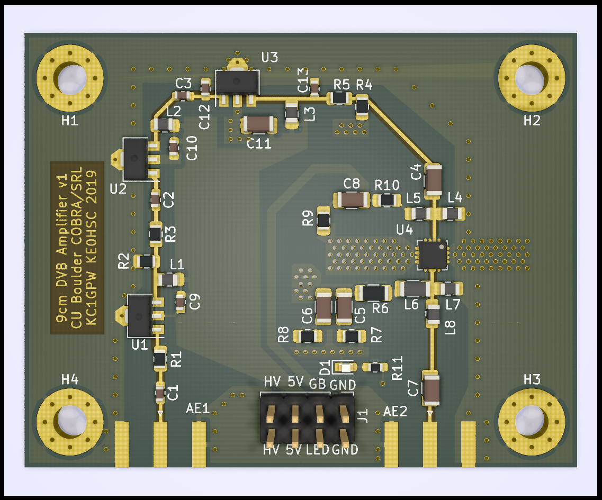

# 9cm DVB amplifier

This amplifier was designed in early 2019 for use as a telemetry/DVB radio for the CU Boulder COBRA/SRL rocket avionics project.

- ~ 15 watts (41.7 dBm) power output
- ~ 50 dB gain
- 3370 MHz center frequency

Note: editing this project requires at least KiCAD 5.99.

Copyright Paul Hansel (KC1GPW) and Brendan Haines (KE0HSC), 2019
